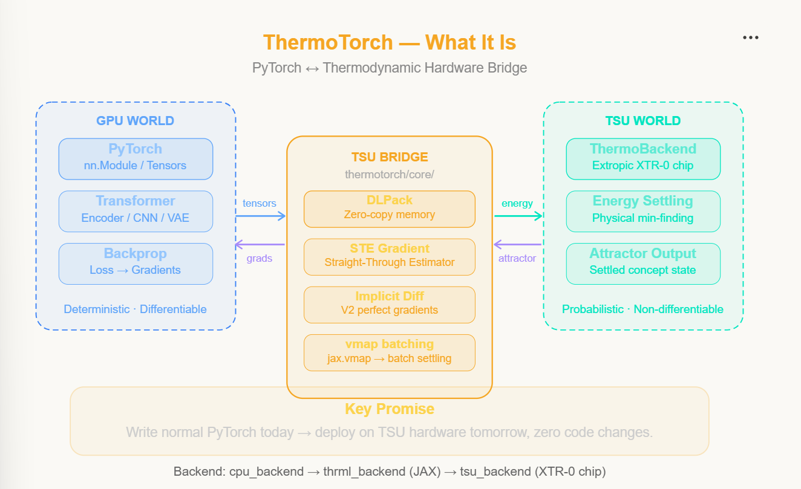
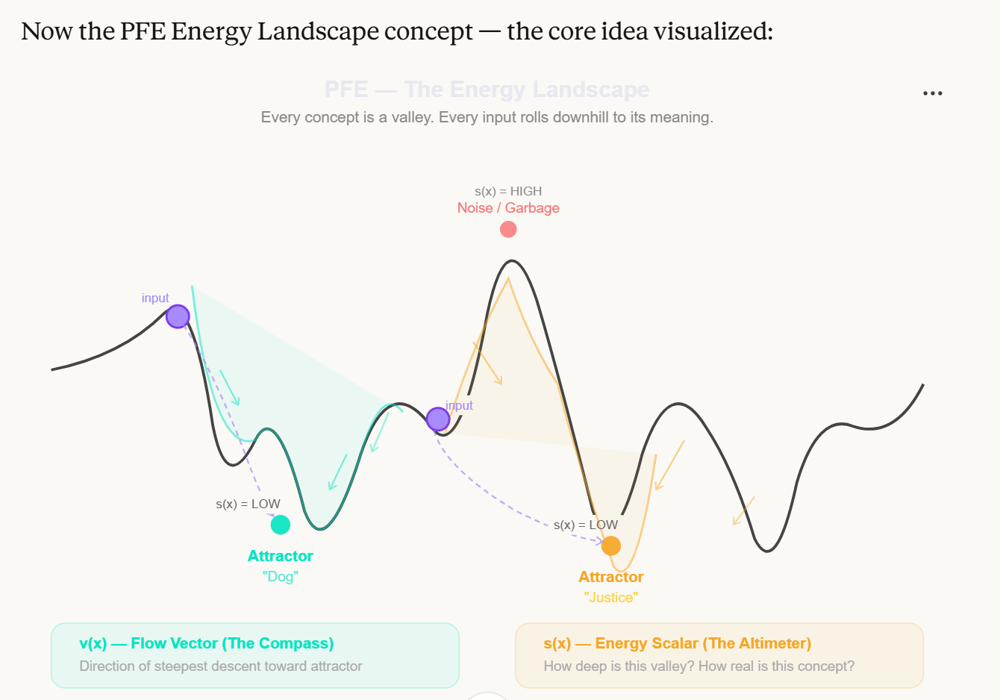
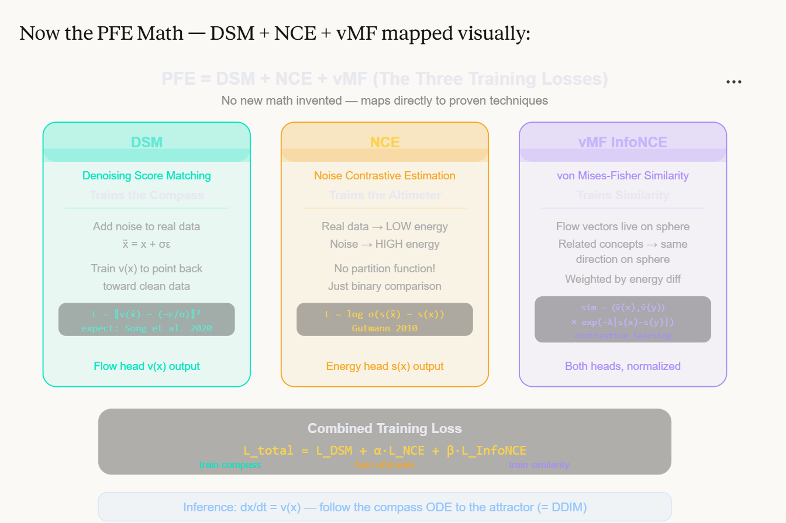
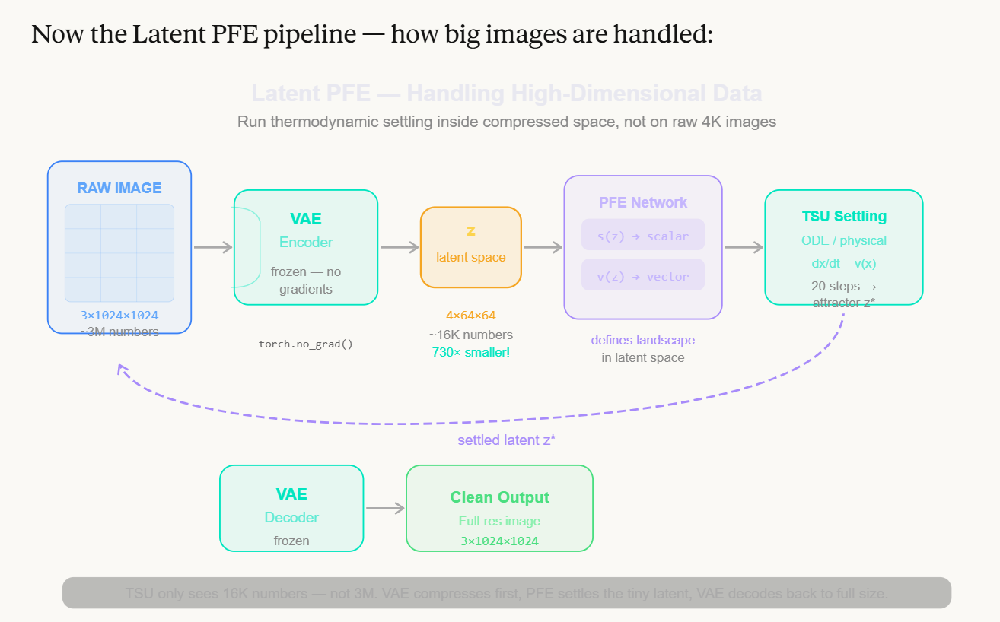
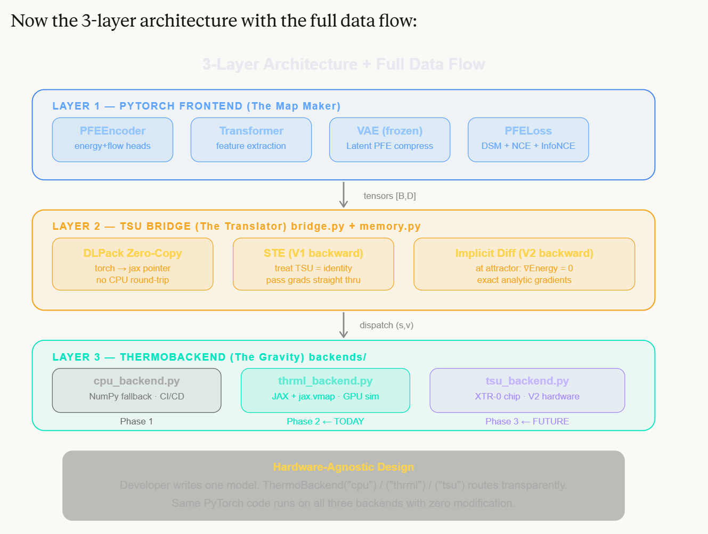

<p align="center">
  <h1 align="center">🔥 ThermoTorch</h1>
  <p align="center"><strong>ThermoTorch is a standalone PyTorch bridge and Latent PFE engine for Extropic's THRML hardware ecosystem.</strong></p>
  <p align="center">
    <em>Write normal PyTorch code. Let physics do the heavy lifting.</em>
  </p>
</p>

<p align="center">
  <a href="https://opensource.org/licenses/Apache-2.0"></a>
  <a href="https://www.python.org/downloads/"></a>
  <a href="https://pytorch.org/"></a>
  <a href="docs/TEST_RESULTS.md"></a>
</p>

---

## Table of Contents

- [The Big Idea](#the-big-idea)
- [Part 1 — What are Potential-Flow Embeddings (PFE)?](#part-1--what-are-potential-flow-embeddings-pfe)
- [Part 2 — What is ThermoTorch?](#part-2--what-is-thermotorch)
- [Part 3 — Using the Project](#part-3--using-the-project)
- [Development Transparency](#development-transparency)
- [License & Citation](#license--citation)

---

# The Big Idea

Today's AI runs on GPUs — chips that are fast but fundamentally **power-hungry**. They compute everything step by step using brute-force matrix math.

A new kind of chip is coming: the **Thermodynamic Sampling Unit (TSU)** by [Extropic AI](https://extropic.ai). These chips don't compute — they **physically settle**. You give them a noisy energy landscape and the laws of physics automatically find the minimum energy state. Like dropping a marble and letting gravity do the work — instantly, ~10,000× more energy-efficient.

**The problem?** The entire AI world is built on PyTorch. Nobody wants to rewrite everything for a new chip.

**ThermoTorch's answer:**

> *"Write your model in normal PyTorch. We'll handle talking to the TSU chip invisibly in the background."*

It's essentially the **CUDA of thermodynamic computing** — just like CUDA lets PyTorch talk to NVIDIA GPUs, ThermoTorch lets PyTorch talk to TSU chips.

<p align="center">
  
</p>
<p align="center"><em>ThermoTorch bridges the GPU world (PyTorch) with the TSU world (thermodynamic hardware) through a zero-copy memory bridge</em></p>

---

# Part 1 — What are Potential-Flow Embeddings (PFE)?

Before understanding ThermoTorch, you need to understand the **math it runs** — Potential-Flow Embeddings.

## The Core Concept: An Energy Landscape

Imagine the meaning of all knowledge as a **hilly landscape:**

- **Valleys** = strong, important concepts (e.g., "dog", "justice", "photosynthesis")
- **Hillsides** = related but less certain ideas
- **Hilltops** = noise, garbage, meaningless combinations

Now imagine you drop a marble anywhere on this landscape. **The marble always rolls downhill and settles at the bottom of the nearest valley.** That valley bottom is called the **Attractor** — the cleanest, truest version of a concept.

<p align="center">
  
</p>
<p align="center"><em>Every concept is a valley. Every input rolls downhill to its meaning. v(x) is the compass, s(x) is the altimeter.</em></p>

PFE gives every point in the landscape **two properties:**

| Property | What It Is | Simple Name |
|----------|-----------|-------------|
| **Energy Scalar `s(x)`** | How deep is this valley? How "real" is this concept? | The **Altimeter** |
| **Flow Vector `v(x)`** | Which direction is downhill from here? | The **Compass** |

Together, the Compass + Altimeter define the entire landscape. The neural network **learns to build this landscape** during training.

### See It in 3D

Here's what the energy landscape actually looks like when visualized — the blue center is the low-energy valley (attractor), the red peaks are high-energy regions (noise), and the blue arrows show the flow vectors pointing toward the attractor:

<p align="center">
  
  
</p>
<p align="center"><em>Left: Single attractor — all flow arrows point toward the valley center. Right: Multiple attractors — particles (blue dots) have settled into energy minima.</em></p>

<p align="center">
  
</p>
<p align="center"><em>Close-up of a complex energy landscape with multiple valleys and peaks. The flow arrows show the direction data would naturally settle.</em></p>

---

## How PFE Training Works — The Three Losses

The beautiful part — **PFE doesn't invent new math.** It maps directly to three well-proven techniques:

<p align="center">
  
</p>
<p align="center"><em>The three training losses, each training a different part of the landscape</em></p>

### 🧭 Loss #1 — DSM (Denoising Score Matching) → Trains the Compass

Take real data, add random noise to mess it up, then ask the network: *"Which way is the clean data?"*

If the compass (flow vector) correctly points back toward the original data, it's working.

```
Add noise:     x̃ = x + σε
Train:         Make v(x̃) point back toward x
Loss:          L = ||v(x̃) - (-ε/σ)||²
```

> *"I messed up the data. Can the compass tell me exactly how to clean it up?"*

### ⛰️ Loss #2 — NCE (Noise Contrastive Estimation) → Trains the Altimeter

Teach the energy head one simple rule: **real data must always have LOWER energy than noise.**

```
Real data → LOW energy (valleys)
Noise     → HIGH energy (hilltops)
Loss:       L = log σ(s(x̃) - s(x))
```

No intractable integrals. Just a binary comparison each step.

### 🔗 Loss #3 — vMF InfoNCE → Trains the Similarity

Once flow vectors are normalized to unit length, they live on a sphere. Two concepts are truly similar only if:
1. Their **compasses point the same direction** (they flow toward the same valley)
2. Their **altimeter readings are similar** (they're at the same depth)

### The Combined Loss

All three are combined into one elegant formula:

```
L_total = L_DSM + α·L_NCE + β·L_InfoNCE
          ─────   ─────────   ─────────────
          Train    Train the    Train the
          compass  altimeter    similarity
```

| Loss | Trains | What It Ensures |
|------|--------|----------------|
| DSM | Flow head `v(x)` | Compass always points toward real data |
| NCE | Energy head `s(x)` | Real data always deeper than noise |
| InfoNCE | Both (normalized) | Related concepts flow to same attractor |

---

## Inference — How the System Answers a Query

Once trained, you give the system a noisy or partial input and it **follows the compass arrows downhill, step by step:**

```python
def tsu_settle(model, x0, steps=20):
    def ode_func(t, x):
        _, v_raw, _ = model(x)   # Ask: which direction is downhill?
        return v_raw              # Move that direction

    trajectory = odeint(ode_func, x0, torch.linspace(0, 1, steps))
    return trajectory[-1]         # Final resting point = the Attractor
```

After settling, the input has rolled all the way to the **attractor** — the cleanest, most meaningful version of the concept. This is **deterministic**, **fast**, and mathematically identical to DDIM from diffusion models.

---

## Latent PFE — Handling Big Images

A 4K image has ~25 million pixel values. Running thermodynamic settling on that many dimensions is impossible. The solution? **Compress first, then settle:**

<p align="center">
  
</p>
<p align="center"><em>The TSU only sees 16K numbers — not 3M. VAE compresses first, PFE settles the tiny latent, VAE decodes back to full size.</em></p>

| Step | What Happens | Size |
|------|-------------|------|
| 1. **Encode** | Frozen VAE compresses the image | 3×1024×1024 → 4×64×64 (~730× smaller!) |
| 2. **Map** | PFE network defines `s(z)` and `v(z)` in latent space | Energy + Flow vectors |
| 3. **Settle** | TSU settles the tiny latent matrix | ~16K numbers instead of ~3M |
| 4. **Decode** | Frozen VAE reconstructs the full-resolution clean image | 4×64×64 → 3×1024×1024 |

This makes TSU hardware **feasible for real-world data sizes**.

---

# Part 2 — What is ThermoTorch?

Now that you understand PFE (the math), let's look at ThermoTorch (the engineering that makes it run).

## The Three-Layer Architecture

ThermoTorch is built in **3 clean layers**, each with a distinct job:

<p align="center">
  
</p>
<p align="center"><em>Layer 1 (PyTorch Frontend) → Layer 2 (TSU Bridge) → Layer 3 (ThermoBackend). Hardware-agnostic by design.</em></p>

### Layer 1 — PyTorch Frontend *(The Map Maker)*

This is what **developers write** — standard PyTorch code. `nn.Module`, `forward()`, optimizers, loss functions. You **never need to know** what hardware is underneath.

Includes:
- `PFEEncoder` — energy + flow heads
- `PFELoss` — combined DSM + NCE + InfoNCE loss
- `LatentPFEEncoder` — VAE wrapper for high-dimensional data

### Layer 2 — TSU Bridge *(The Translator)*

The most **technically complex** part. It does three critical things:

| Component | What It Solves |
|-----------|---------------|
| **DLPack Zero-Copy** | Memory transfer between PyTorch ↔ JAX without copying (shared GPU pointers) |
| **STE Gradients (V1)** | Lets backpropagation work through non-differentiable TSU settling |
| **Implicit Diff (V2)** | Exact gradients using the Implicit Function Theorem at the attractor |

**The Gradient Problem** is the hardest challenge: physical thermodynamic settling is **not differentiable** — you can't take the derivative of "a marble rolled downhill." ThermoTorch solves this:

```
FORWARD:   Input → [TSU Settling] → Settled Output     ✅ Real physics
BACKWARD:  Gradient → [Pretend TSU = Identity] → Grad   ✅ STE trick
```

### Layer 3 — ThermoBackend *(The Gravity)*

The actual engine that runs the settling. **Completely swappable** — same PyTorch code works on all three:

| Backend | What It Does | When To Use |
|---------|-------------|-------------|
| `cpu_backend` | Pure NumPy/SciPy fallback | CI/CD testing, debugging |
| `thrml_backend` | JAX + `jax.vmap` GPU simulation | Development & training today |
| `tsu_backend` | Real Extropic XTR-0 chip hardware | Future production deployment |

---

## The ThermoTorch Pipeline In Action

<p align="center">
  
</p>
<p align="center"><em>The full pipeline: PyTorch computes the graph digitally, the Bridge translates, and the TSU physically settles to the energy minimum.</em></p>

---

## Development Phases

| Phase | Focus | Status |
|-------|-------|--------|
| **Phase 1** — Validate | Pure PyTorch + CPU backend. Prove STE works with a non-differentiable black box. | ✅ Complete |
| **Phase 2** — Performance | JAX/GPU simulation with DLPack + `jax.vmap`. Real training speeds. | ✅ Complete |
| **Phase 3** — Hardware | Implicit Differentiation + real XTR-0 chip drivers. Zero code changes for devs. | 🔧 In Progress |

---

# Part 3 — Using the Project

## Quick Start

### Installation

```bash
# Clone the repository
git clone https://github.com/mkrishna793/Thermo-Torch.git
cd Thermo-Torch

# Install dependencies
pip install -e .

# With JAX support (for THRML backend)
pip install -e ".[jax]"
```

### Basic Usage

```python
import torch
from thermotorch import PFEEncoder, PFELoss, tsu_settle

# Create the PFE model
model = PFEEncoder(embed_dim=512)
criterion = PFELoss(sigma=0.1, alpha=0.1, beta=0.5)

# Prepare data (anchor, positive, noise)
x = torch.randn(32, 512)
x_pos = x + torch.randn_like(x) * 0.05    # Similar data
x_noise = torch.randn(32, 512)             # Random noise

# Train — loss teaches the landscape
loss = criterion(model, x, x_pos, x_noise)
loss.backward()

# Inference — settle noisy input to the attractor
noisy = torch.randn(8, 512)
clean = tsu_settle(model, noisy, steps=50)
```

---

## API Reference

### PFEEncoder

The core neural network with energy + flow heads:

```python
encoder = PFEEncoder(
    embed_dim=512,      # Input/output dimension
    hidden_dim=1024,    # Hidden layer size
    num_layers=2        # Depth of the network
)

# Returns: (energy_scalar, flow_vector_raw, flow_vector_unit)
energy, flow_raw, flow_unit = encoder(x)
```

### PFELoss

Combined training loss (DSM + NCE + InfoNCE):

```python
criterion = PFELoss(
    sigma=0.1,    # Noise level for DSM
    alpha=0.1,    # Weight for NCE loss
    beta=0.5      # Weight for InfoNCE loss
)
loss = criterion(model, anchor, positive, noise)
```

### TSULayer

Drop-in replacement for compute-heavy layers:

```python
from thermotorch.core import TSULayer

layer = TSULayer(steps=50, method='rk4')
settled = layer(model, noisy_data)
```

### Backends

Switch hardware with one line — zero code changes:

```python
# CPU backend (always works, good for testing)
from thermotorch.backends import CPUBackend
backend = CPUBackend(method='euler')

# THRML backend (JAX/GPU simulation — use for real training)
from thermotorch.backends import THRMLBackend
backend = THRMLBackend(device='gpu')

# TSU backend (physical hardware — future)
from thermotorch.backends import TSUBackend
backend = TSUBackend(fallback_to_thrml=True)
```

---

## Project Structure

```
thermotorch/
├── core/                       # Core framework components
│   ├── pfe_encoder.py         # PFEEncoder — energy + flow heads
│   ├── pfe_loss.py            # PFELoss — DSM + NCE + InfoNCE
│   ├── tsu_settle.py          # ODE-based settling (probability flow)
│   ├── memory.py              # DLPack zero-copy memory bridge
│   ├── bridge.py              # Autograd integration (STE + Implicit Diff)
│   └── tsu_layer.py           # TSULayer — drop-in nn.Module
│
├── backends/                   # Hardware abstraction layer
│   ├── base.py                # Abstract base class (interface contract)
│   ├── cpu_backend.py         # NumPy fallback (Phase 1)
│   ├── thrml_backend.py       # JAX + vmap GPU simulation (Phase 2)
│   └── tsu_backend.py         # Extropic XTR-0 chip interface (Phase 3)
│
├── models/                     # Example applications
│   ├── pfe_memory.py          # Vector database using PFE
│   └── dtm_diffusion.py       # Thermodynamic image generation
│
├── examples/                   # Ready-to-run examples
│   ├── train_pfe.py           # Full PFE training script
│   └── latent_pfe_example.py  # Latent PFE for images
│
├── tests/                      # 78 passing tests
│   ├── test_dlpack.py         # Verifies zero-copy memory
│   └── test_gradients.py      # Verifies STE doesn't break autograd
│
└── docs/                       # Documentation & visuals
    ├── TEST_RESULTS.md        # Detailed test results
    └── images/                # Diagrams & visualizations
```

---

## Test Results

All 78 tests pass across three phases:

```
============================= 78 passed in 18.16s =============================

Phase 1 (PFE Core):      15 tests ✅  — Encoder, loss, settling
Phase 2 (Bridge/Layers): 31 tests ✅  — DLPack, STE, autograd
Phase 3 (Backends):      32 tests ✅  — CPU, THRML, TSU
```

See [TEST_RESULTS.md](docs/TEST_RESULTS.md) for the full breakdown.

---

## Related Projects

ThermoTorch builds upon and integrates with:

- **[Extropic AI](https://extropic.ai/)** — Thermodynamic computing hardware
- **[THRML Library](https://github.com/extropic-ai/thrml)** — Thermodynamic HypergRaphical Model Library for JAX
- **[PyTorch](https://pytorch.org/)** — Deep learning framework

### Research Papers

- Denoising Thermodynamic Models (DTM) — [arXiv:2510.23972](https://arxiv.org/abs/2510.23972)
- Energy-Based Models and Gibbs Sampling
- Song et al., 2020 — Denoising Score Matching
- Gutmann & Hyvärinen, 2010 — Noise Contrastive Estimation

---

# Development Transparency

### How This Project Was Built

This project was conceived, planned, and designed by **N. Mohana Krishna**. The implementation was executed collaboratively with **Claude Code (Anthropic's Claude)**, an AI coding assistant.

**What this means in practice:**

- ✅ **Idea, architecture design, and project planning** — entirely human
- ✅ **Understanding of PFE theory and thermodynamic computing** — self-studied and validated
- ✅ **Code implementation** — AI-assisted (Claude Code wrote the code under human direction)
- ✅ **Testing and verification** — 78 tests validate correctness across all components
- ✅ **All code is open-source** — fully auditable and transparent

**Why be transparent?** Building production-quality code with AI assistance is a legitimate and increasingly common practice. By being upfront about it, anyone reviewing this project can evaluate the code on its own merits. The test suite, architecture decisions, and documentation speak for themselves.

> *AI doesn't replace understanding — it amplifies execution. The idea has to come from somewhere.*

---

## Contributing

Contributions are welcome! Please read [CONTRIBUTING.md](CONTRIBUTING.md) for guidelines.

---

## License

```
Copyright 2024-2026 N. Mohana Krishna

Licensed under the Apache License, Version 2.0 (the "License");
you may not use this file except in compliance with the License.
You may obtain a copy of the License at

    http://www.apache.org/licenses/LICENSE-2.0

Unless required by applicable law or agreed to in writing, software
distributed under the License is distributed on an "AS IS" BASIS,
WITHOUT WARRANTIES OR CONDITIONS OF ANY KIND, either express or implied.
See the License for the specific language governing permissions and
limitations under the License.
```

## Citation

If you use ThermoTorch in your research, please cite:

```bibtex
@software{thermotorch2024,
  author = {Krishna, N. Mohana},
  title = {ThermoTorch: A PyTorch Framework for Potential-Flow Embeddings and Thermodynamic Computing},
  year = {2024},
  url = {https://github.com/mkrishna793/Thermo-Torch}
}
```

---

<p align="center">
  <strong>ThermoTorch</strong> — <em>Write normal PyTorch today → deploy on thermodynamic hardware tomorrow, zero code changes.</em>
</p>